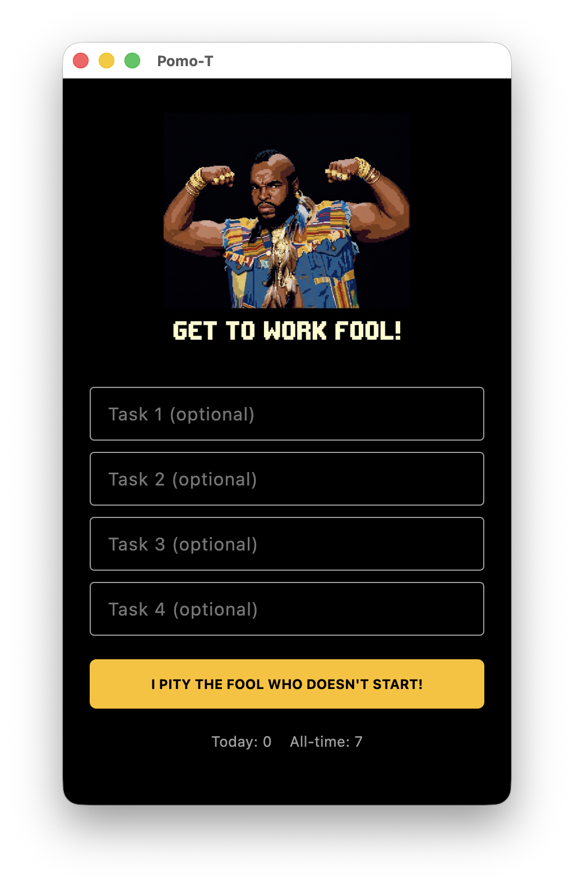

# Pomo-T

A sleek, 80s-themed Pomodoro timer desktop application for macOS featuring the legendary Mr. T. 

## Overview
Pomo-T helps you manage your time effectively by breaking your work into focused intervals, traditionally 25 minutes in length, separated by short breaks. With a dynamic Mr. T theme, it brings a bit of fun and tough love to your productivity!

## Features
- Customizable work and break intervals
- Task management and tracking
- Daily and all-time Pomodoro statistics
- "Tough love" voice prompts and 80s aesthetics with Mr. T!
- Floating, compact active timer window

## Screenshot


## Getting Started
To run the project locally, ensure you have Flutter installed:
```bash
flutter run -d macos
```
